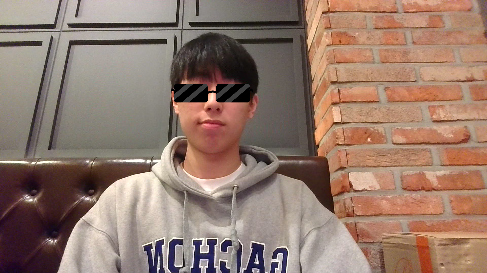
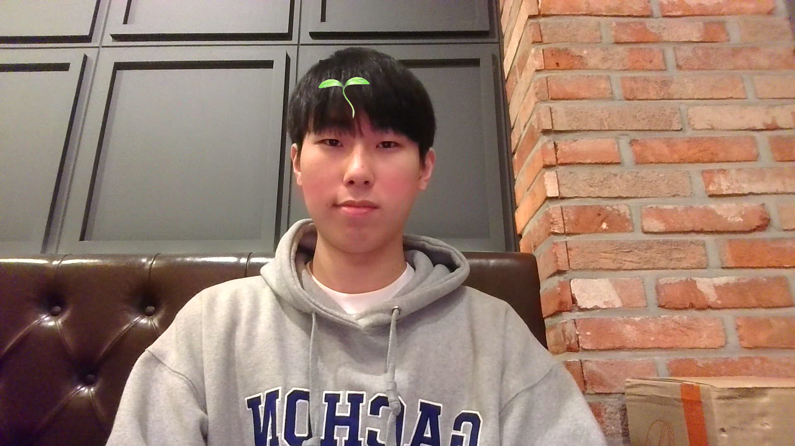
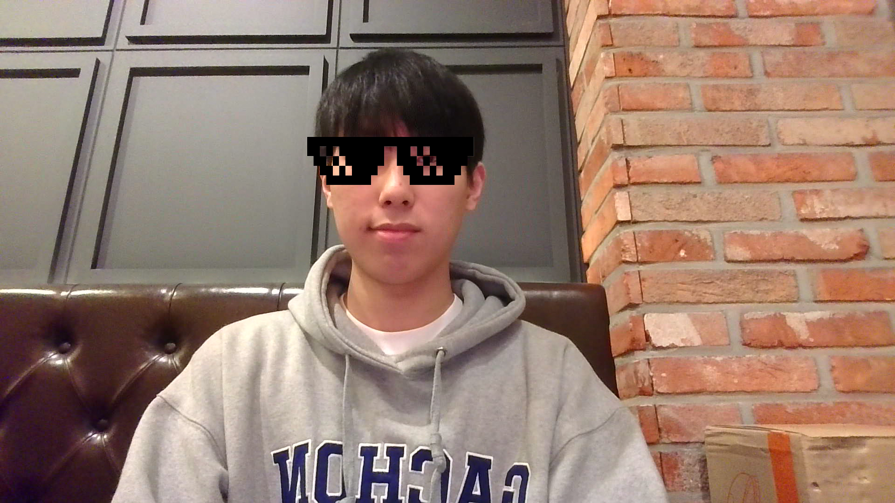

# openCV_termproject

teamname : Commit soon

# Face Filter Application

This project is a simple face filter application that detects faces from a webcam feed and applies various stickers to them.

## Overview

The application leverages OpenCV for face detection and image manipulation. Users can cycle through different face filters in real-time, providing an entertaining and interactive experience.

## Example





## Usage

1. **Environment Setup**

   - Install Python 3.x, or a newer version.
   - Install required libraries by running the following command:

     ```bash
     pip install opencv-python numpy
     ```

2. **Add Face Filter Images**

   - Add image files for face filters to the project folder.

3. **Run**

   - Start the face filter application by executing the following command in the terminal:

     ```bash
     python face_filter_app.py
     ```

4. **Key Events**

   - Press '1' to change to different face filters.
   - Press 'q' to exit the application.

## Notes

- Face filter images should be in PNG format with support for a transparent background.
- Face detection utilizes Haarcascades, and you can experiment with different classifiers for improved accuracy.

# References

- https://dustinkim86.github.io/posts/python-opencv4/ (OpenCV filter)
- https://velog.io/@choi_4843/OpenCV-%EC%B9%B4%EB%A9%94%EB%9D%BC-%EC%8A%A4%ED%8B%B0%EC%BB%A4-%EB%A7%8C%EB%93%A4%EA%B8%B0 (Make a camera sticker)